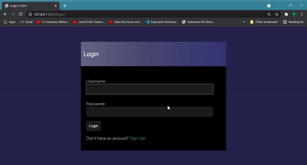

# Django To Do WebApp 2.0
A simple to-do app with CRUD functionality using class-based views. 
This project is learnt from <a href="https://www.youtube.com/watch?v=llbtoQTt4qw&t=2770s">here</a>

 
<h3>Installing and using a Virtual Environment</h3>

`pip install virtualenvwrapper-win` 
`mkvirtualenv test` &nbsp; _test = name of virtual env_

 
<h3>Install required packages:</h3>

`pip install Django`  

<h3>To run project:</h3>

`pip install -r requirements.txt` 
_After ensuring that we are in a virtual environment (If not, use `workon test`)_

`python manage.py makemigrations`  
`python manage.py migrate`  
`python manage.py runserver` 

Visit development server http://127.0.0.1:8000 

 
<h3>Create Super user:</h3>

`python manage.py createsuperuser`

Enter desired credentials

 

<h3>Admin Site:</h3>

http://127.0.0.1:8000/admin

 
<h3>Implemented Features</h3>
<ul>
    <li>User Authentication</li>
    <li>Create, Read, Update and Delete Tasks</li>
    <li>Search for Tasks</li>
</ul>
 
<h3>Planned Features</h3>
<ul>
    <li>Reset, Change Password</li>
</ul>

